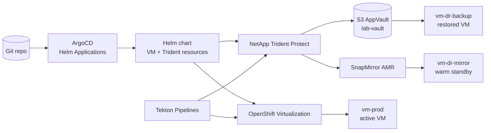

# Modern Virtualization, GitOps, Tekton, and NetApp Trident Protect

This demo shows how a VM platform can look and operate when it is treated as cloud-native infrastructure instead of a separate virtualization silo.

The story is not just disaster recovery. The complete narrative is:

- A VM is declared in Git and reconciled by ArgoCD from a Helm chart.
- Application installation, upgrade, smoke testing, and rollback are orchestrated by Tekton pipelines.
- OpenShift Virtualization provides the VM runtime and VM console experience.
- NetApp Trident provides fast storage cloning, snapshots, backup, restore, and SnapMirror-based DR.
- Operators use the OpenShift console, ArgoCD UI, and Pipelines UI to see the same state that the CLI and Git declare.

The audience should leave with one message: modern virtualization is VM lifecycle, app lifecycle, storage protection, and DR expressed as code and driven by controllers.

## Demo Positioning

Use this demo when the audience cares about any of these questions:

- How do we modernize VM operations without rewriting the application?
- How do we make VM changes auditable and repeatable?
- How do we upgrade and roll back VM-hosted applications without manual SSH sessions?
- How do we protect a VM with NetApp snapshots, backups, and replication?
- How do GitOps, Tekton, OpenShift Virtualization, and Trident fit together in a single operating model?

## NetApp Trident Protect Core Concepts

To present this demo effectively, it is essential to understand the underlying declarative custom resources introduced by Trident Protect:

1.  **`Application` (protect.trident.netapp.io)**: 
    *   Defines the logical boundary of our application (by namespace, labels, or resource filters). 
    *   Treats the virtual machine, persistent volumes, and all associated Kubernetes manifests (Configs, Services, Secrets) as a single, consistent logical entity for backup or replication.
2.  **`AppVault` (protect.trident.netapp.io)**: 
    *   The declarative Kubernetes representation of an offsite object-storage target (like an AWS S3 bucket).
    *   Used by Trident Protect to securely archive and synchronize volume block payloads, metadata, and cluster snapshots.
3.  **`Snapshot` & `ExecHook`**: 
    *   Instantly captures the point-in-time state of both storage PVs and application metadata. 
    *   Seamlessly integrates with `ExecHook` resources to execute shell scripts (such as filesystem freezes and database flushes) inside the Guest OS container/pod, delivering guaranteed **application-consistency**.
4.  **`Backup` & `BackupRestore`**: 
    *   Uses the high-performance **Kopia** data mover to pack, deduplicate, encrypt, and copy point-in-time volume blocks and metadata to the S3 `AppVault`.
    *   `BackupRestore` reads this archive and recreates the target namespaces, PVs, and KubeVirt VMs from scratch.
5.  **`AppMirrorRelationship` (AMR)**: 
    *   Couples high-speed **asynchronous volume replication (SnapMirror)** directly at the NetApp ONTAP storage controller level with **Kubernetes metadata staging** in S3.
    *   Enables completely declarative, GitOps-compatible warm-standby DR. Changing the `desiredState` to `Promoted` unblocks the destination volumes and automatically boots the standby VM in seconds.

## Core Narrative

The demo runs in six acts. **Act 1 kicks off the long-running S3 backup/restore pipeline first**, so it completes in the background while the presenter demonstrates the application lifecycle in Acts 2–5. Act 6 comes back to inspect the restored namespace.

Parameter management uses the **`argocd` CLI** (`argocd app set --parameter`) for clean, readable rollbacks and DR promotion instead of verbose JSON patches.

### Act 1: Kick off S3 Cloud Backup & Restore (Runs in Background ~14 min)

The production VM is deployed first. While it boots, the S3 backup and restore pipeline is fired off immediately. The Tekton backup task copies the 30GB volume to AWS S3 and submits a `BackupRestore` CR. The Kopia data mover starts restoring blocks from S3 in the background — the presenter moves on to demo the lifecycle.

Show:
- `argocd/argocd-prod-app.yaml`: ArgoCD owns the production environment.
- `chart/values.yaml`: Blue VM active, Green halted, traffic on blue.
- Pipeline tasks and DR pipeline definition.
- The Trident Protect `Application` resource tracking `vm-prod`.

Run:
```bash
oc apply -f argocd/argocd-prod-app.yaml
tkn pipeline start trident-dr-pipeline -n vm-prod \
  -p application-name=centos-vm-app \
  -p destination-namespace=vm-dr-backup --showlog
```

### Act 2: Tekton + Ansible — Deploy App v1.0

The VM is running, but the application should not be installed by a human SSH session.

The intended flow mirrors the existing `gitops-vmware-virt-demo` lifecycle:

- Tekton waits until the VM is ready.
- Ansible or shell tasks install the application inside the guest.
- A smoke test validates `/health` through the service.
- The pipeline result becomes the audit trail.

Recommended implementation:

- Reuse the existing concepts from `gitops-vmware-virt-demo/pipelines/install-pipeline.yaml`.
- Keep app configuration in `pipelines/app-version.yaml`.
- Keep guest access through Kubernetes Secrets and cloud-init, not passwords.
- Expose the application through a Kubernetes `Service`, preferably a LoadBalancer when the cluster supports it.

Console moment:

- Open `Pipelines -> Pipelines` in the OpenShift console.
- Show the `install-app` pipeline DAG.
- Open the PipelineRun logs while it installs v1.0.
- Switch to `Networking -> Services` and show the service selector and endpoint.

Speaker note:

> The guest is still a VM, but operations are no longer a manual VM procedure. Tekton gives us the same pipeline discipline we use for containers: logs, task status, retries, and auditability.

### Act 3: Blue/Green Upgrade using Trident Snapshots

The main virtualization modernization moment. One Git commit triggers a pipeline that:

1. Takes a Trident Protect `Snapshot` of the Blue VM (safety net + clone source).
2. Resolves the generated CSI `VolumeSnapshot` for the Blue root disk PVC.
3. Patches ArgoCD parameters to start Green from the Blue snapshot (instant ONTAP clone).
4. Ansible upgrades the app on Green to v2.0.
5. Smoke-tests Green's `/health` directly.
6. Cuts traffic to Green and halts Blue.

Runtime state changes happen via ArgoCD Helm parameters — no Git commits for transient VM state.

Commands:
```bash
ruby -0pi -e 'gsub(/version: "v[0-9.]+"/, "version: \"v2.0\"")' \
  pipelines/app-version.yaml
git add pipelines/app-version.yaml
git commit -m 'bump app version to v2.0'
git push origin main
tkn pipeline start upgrade-app -n vm-prod --showlog
```

### Act 4: GitOps Declarative Rollback

Rollback is presenter-driven, using `argocd app set` for clean, readable parameter management:

```bash
# Step 1: Restart Blue while traffic still flows to Green
argocd app set trident-dr-prod -N openshift-gitops \
  -p blue.runStrategy=Always \
  -p green.runStrategy=Always \
  -p traffic.activeSlot=green

# Step 2: Shift traffic back to Blue, halt Green
argocd app set trident-dr-prod -N openshift-gitops \
  -p blue.runStrategy=Always \
  -p green.runStrategy=Halted \
  -p traffic.activeSlot=blue

# Step 3: Clear all parameters — ArgoCD restores Git baseline
argocd app set trident-dr-prod -N openshift-gitops
```

### Act 5: GitOps-Driven SnapMirror DR Failover

Pattern A uses `AppMirrorRelationship` for warm-standby DR. Block replication at the ONTAP storage layer, metadata staging in S3:

1. Create a Trident Protect `Snapshot` to seed the mirror.
2. Deploy the mirror ArgoCD Application into `vm-dr-mirror`.
3. Link to the source Application UID via `argocd app set`.
4. Promote the relationship to `Promoted` — volumes become Read-Write, VM boots.

```bash
cat <<EOF | oc apply -f -
apiVersion: protect.trident.netapp.io/v1
kind: Snapshot
metadata: { name: source-vm-snap, namespace: vm-prod }
spec: { applicationRef: centos-vm-app, appVaultRef: lab-vault }
EOF

oc apply -f argocd/argocd-dr-mirror-app.yaml

SOURCE_UID=$(oc get application.protect.trident.netapp.io \
  centos-vm-app -n vm-prod -o jsonpath='{.metadata.uid}')

argocd app set trident-dr-mirror -N openshift-gitops \
  -p trident.amr.sourceAppUID="${SOURCE_UID}" \
  -p trident.amr.desiredState=Promoted
```

### Act 6: Verify S3 Backup/Restore Results

By now the Kopia data mover has finished restoring the 30GB volume from AWS S3. Navigate to `vm-dr-backup` and show the restored VM running.

```bash
oc get vm -n vm-dr-backup
```

## Recommended Console Flow

Use the console intentionally. Do not stay in the terminal the whole time.

| Moment | Console | What To Show | Why It Matters |
|---|---|---|---|
| S3 backup kick-off | Pipelines + Trident CRs | `Backup`, `BackupRestore`, Kopia pod | Long-running backup runs in background |
| VM creation | OpenShift Virtualization | `centos-vm-blue` / `centos-vm-green` in `vm-prod` | Operators still get a VM console and VM inventory |
| GitOps sync | ArgoCD | `trident-dr-prod` app and rendered Helm resources | Git is the source of truth |
| App install | OpenShift Pipelines | `install-app` DAG and logs | Guest changes are auditable automation |
| Upgrade | Pipelines + Virtualization | snapshot/start green/upgrade/smoke/cutover | VM lifecycle is pipeline-driven |
| Rollback | ArgoCD UI | `argocd app set` parameter changes | Recovery is declarative state, not panic ops |
| Mirror DR | ArgoCD + Trident CRs | `AppMirrorRelationship` states | DR is GitOps-compatible |
| S3 restore check | Virtualization + Trident CRs | Restored VM in `vm-dr-backup` | Portable DR from object storage |

## What Should Be Improved Next

The current automated `test-flow.sh` validates the full lifecycle: production VM, Ansible install, Trident Protect snapshot-based Blue/Green upgrade, declarative rollback, S3 backup/restore DR, and SnapMirror AMR promotion.

Prioritized improvements:

1. Add console screenshots or presenter notes for each act.
2. Add a pre-recorded asciinema cast for the long-running Kopia restore to use as a transition.
3. Parameterize hardcoded namespace names into environment variables for portability.
4. Add an ArgoCD `AppProject` and dedicated RBAC scope instead of the broad `cluster-admin` binding.
5. Integrate the `argocd app wait` command to eliminate polling loops in scripts.

## Architecture



## Repository Layout

```text
gitops-trident-protect-dr-demo/
├── README.md
├── chart/
│   ├── Chart.yaml
│   ├── values.yaml
│   ├── values-prod.yaml
│   ├── values-dr-mirror.yaml
│   ├── values-dr-backup.yaml
│   └── templates/
│       ├── vm-blue.yaml
│       ├── vm-green.yaml
│       ├── service-lb.yaml
│       ├── service-blue-ssh.yaml
│       ├── service-green-ssh.yaml
│       ├── service-green-http.yaml
│       ├── trident-app.yaml
│       └── trident-amr.yaml
├── argocd/
│   ├── argocd-prod-app.yaml
│   └── argocd-dr-mirror-app.yaml
├── pipelines/
│   ├── app-version.yaml
│   ├── install-pipeline.yaml
│   ├── install-pipelinerun.yaml
│   ├── upgrade-pipeline.yaml
│   ├── upgrade-pipelinerun.yaml
│   ├── dr-pipeline.yaml
│   └── tasks/
│       ├── ansible-run-playbook.yaml
│       ├── smoke-test.yaml
│       ├── trident-protect-backup.yaml
│       └── trident-protect-restore.yaml
├── scripts/
│   └── cleanup.sh
└── demo/
    ├── demo-trident.sh
    └── test-flow.sh
```

## Prerequisites

| Requirement | Notes |
|---|---|
| OpenShift Virtualization | KubeVirt VM runtime and console |
| OpenShift GitOps | ArgoCD instance in `openshift-gitops` |
| OpenShift Pipelines | Tekton tasks and PipelineRuns |
| NetApp Trident | `storage-class-iscsi` and CSI snapshots |
| Trident Protect | CRDs and controller in `trident-protect` |
| AppVault | `lab-vault` available and healthy |
| CentOS boot source | `centos-stream10` DataSource ready |

Quick checks:

```bash
oc get ns openshift-gitops openshift-pipelines openshift-cnv trident-protect
oc get appvault -A
oc get storageclass storage-class-iscsi
oc get datasource centos-stream10 -n openshift-virtualization-os-images \
  -o jsonpath='{.status.conditions[?(@.type=="Ready")].status}{"\n"}'
oc get crd | grep protect.trident.netapp.io
```

## Running The Current Automated Flow

The current headless flow validates the DR parts of the module:

```bash
./gitops-trident-protect-dr-demo/demo/test-flow.sh
```

The script:

1. Cleans up stale state.
2. Grants demo RBAC for ArgoCD and Tekton.
3. Deploys the production VM and Trident Protect Application through ArgoCD.
4. Runs the S3 backup/restore Tekton pipeline.
5. Establishes and promotes the AMR mirror path.
6. Verifies restored/promoted VMs reach `Running`.

## Cleanup

```bash
./gitops-trident-protect-dr-demo/scripts/cleanup.sh
```

The cleanup script removes demo namespaces, ArgoCD applications, demo cluster rolebindings, Trident Protect resources, and stuck CSI snapshot finalizers.
