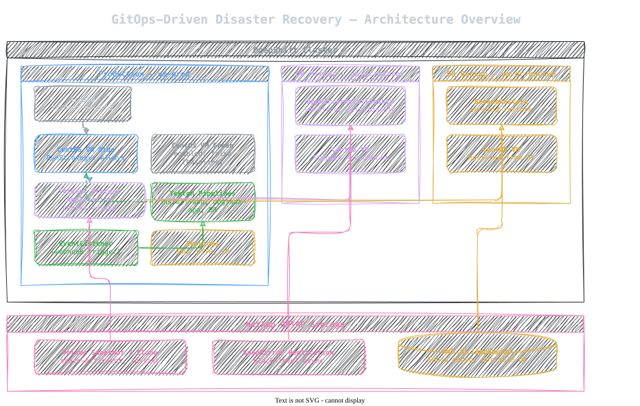
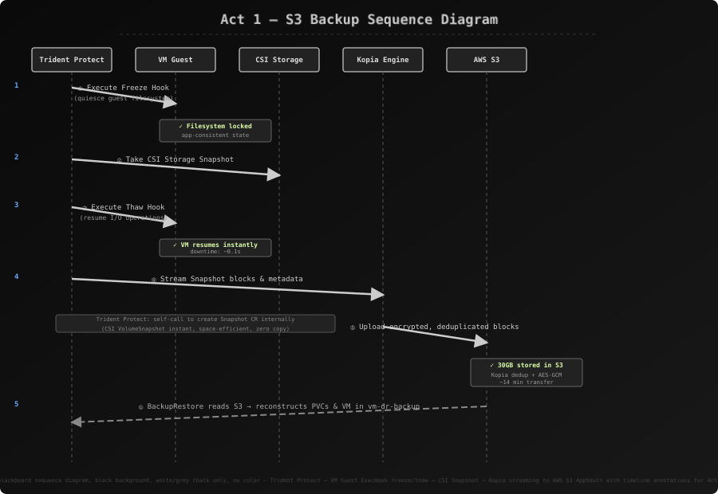
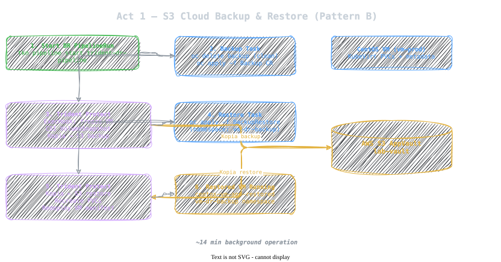
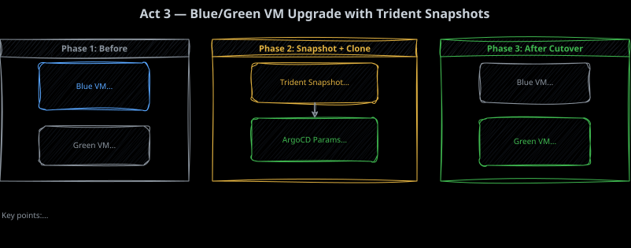
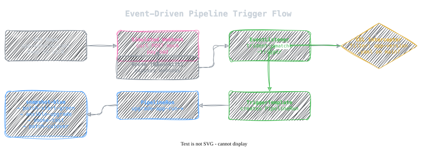
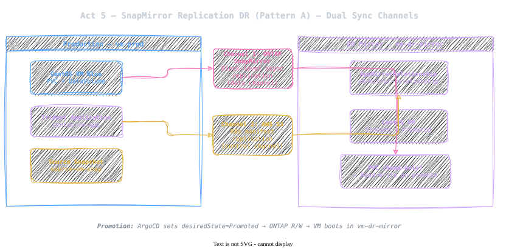

# Modern Virtualization, GitOps, Tekton, and NetApp Trident Protect

**High-level summary:** This demo walks through the complete lifecycle of a VM-hosted application on OpenShift Virtualization — from initial deployment, through automated upgrades and rollbacks, to disaster recovery — all driven declaratively by Git, ArgoCD, Tekton pipelines, and NetApp Trident Protect. No manual SSH, no snowflake configurations, no separate backup consoles. The entire operating model is expressed as code and reconciled by controllers.

The six-act flow tells a single story: a production CentOS VM running a web application that is **deployed via GitOps**, **installed via Ansible-in-Tekton**, **upgraded via Blue/Green with storage snapshots**, **rolled back declaratively**, **replicated via SnapMirror for sub-minute RPO DR**, and **backed up to offsite S3 for portable recovery**.

> **Core takeaway:** Modern virtualization means VM lifecycle, app lifecycle, storage protection, and DR — all expressed as code and driven by controllers. The infrastructure converges into one auditable, repeatable GitOps workflow.

---

## Real-World Relevance

Every act in this demo maps directly to scenarios that platform engineering, SRE, and virtualization teams face daily:

| Act | Real-World Scenario | Why It Matters |
|-----|-------------------|----------------|
| **Act 1 — S3 Backup & Restore** | Offsite DR for regulated industries (finance, healthcare) requiring air-gapped, object-storage copies. Compliance auditors demand proof that backups are immutable and restorable. | Replaces tape libraries and manual offsite rotation. Kopia dedup + encryption means backups are both efficient and verifiable. |
| **Act 2 — Ansible via Tekton** | Teams migrating legacy VMs to OpenShift Virtualization need to keep their existing Ansible playbooks but want pipeline-driven execution instead of SSH-from-a-jumpbox. | No SSH keys floating around. Every run is audited, logged, and reproducible. The same playbook that worked on bare metal works in the pipeline. |
| **Act 3 — Blue/Green Upgrade** | Production application needs a zero-downtime upgrade. The business cannot tolerate the 30-minute outage window of the old "maintenance Saturday" approach. | NetApp zero-copy clones mean the green environment costs nothing in extra storage. If the upgrade fails, blue is still running untouched. |
| **Act 4 — Declarative Rollback** | A new release introduces a subtle memory leak discovered 4 hours after deployment. Operations needs to revert immediately without a Git commit, PR review, or pipeline re-run. | `argocd app set` changes live state in seconds. Clearing the override returns to Git baseline — no configuration drift. |
| **Act 5 — SnapMirror DR** | A primary datacenter outage. RTO is 5 minutes, RPO is under 1 minute. The DR site must come online without manual intervention. | AMR failover is a single parameter change via GitOps. No runbooks, no manual LUN mapping, no storage admin tickets. |
| **Act 6 — S3 Restore Verification** | Quarterly DR test. Compliance requires proof that offsite backups can be restored successfully within SLA. | The restore already ran while the presenter was demoing acts 2–5. The VM is booted and ready — proof that the pipeline works end-to-end. |

---

## Demo Positioning

Use this demo when the audience asks:

- How do we modernize VM operations without rewriting the application?
- How do we make VM changes auditable, repeatable, and automated?
- How do we upgrade and roll back VM-hosted applications without manual SSH sessions?
- How do we protect a VM with NetApp snapshots, backups, and replication?
- How do GitOps, Tekton, OpenShift Virtualization, and Trident fit together in a single operating model?

---

## NetApp Trident Protect Core Concepts

To present this demo effectively, it is essential to understand the underlying declarative custom resources introduced by Trident Protect:

1. **`Application` (protect.trident.netapp.io)**:
   * Defines the logical boundary of our application (by namespace, labels, or resource filters).
   * Treats the virtual machine, persistent volumes, and all associated Kubernetes manifests (Configs, Services, Secrets) as a single, consistent logical entity for backup or replication.
2. **`AppVault` (protect.trident.netapp.io)**:
   * The declarative Kubernetes representation of an offsite object-storage target (like an AWS S3 bucket).
   * Used by Trident Protect to securely archive and synchronize volume block payloads, metadata, and cluster snapshots.
3. **`Snapshot` & `ExecHook`**:
   * Instantly captures the point-in-time state of both storage PVs and application metadata.
   * Seamlessly integrates with `ExecHook` resources to execute shell scripts (such as filesystem freezes and database flushes) inside the Guest OS container/pod, delivering guaranteed **application-consistency**.
4. **`Backup` & `BackupRestore`**:
   * Uses the high-performance **Kopia** data mover to pack, deduplicate, encrypt, and copy point-in-time volume blocks and metadata to the S3 `AppVault`.
   * `BackupRestore` reads this archive and recreates the target namespaces, PVs, and KubeVirt VMs from scratch.
5. **`AppMirrorRelationship` (AMR)**:
   * Couples high-speed **asynchronous volume replication (SnapMirror)** directly at the NetApp ONTAP storage controller level with **Kubernetes metadata staging** in S3.
   * Enables completely declarative, GitOps-compatible warm-standby DR. Changing the `desiredState` to `Promoted` unblocks the destination volumes and automatically boots the standby VM in seconds.

---

## Architecture Overview



> **AI Image Prompt:** "hand-drawn technical illustration in chalk-on-blackboard style, pure black background, monochrome white and grey ink only, no color — architecture overview of GitOps-driven disaster recovery with ArgoCD, Tekton, OpenShift Virtualization, and NetApp Trident Protect showing three namespace zones (vm-prod, vm-dr-mirror, vm-dr-backup) with VM Blue/Green, S3 AppVault, and SnapMirror AMR"

---

## Core Narrative & Demo Flow

The demo runs in six cohesive acts. **Act 1 kicks off the long-running S3 backup/restore pipeline first**, so it completes in the background while you demonstrate the application lifecycle in Acts 2–4. Act 5 demonstrates SnapMirror replication, and Act 6 brings the audience back to inspect the completed offsite S3 restore.

---

### Act 1: S3 Cloud Backup & Restore (Pattern B)

#### Narrative Focus
We begin by deploying our production CentOS VM environment and firing off an on-demand offsite S3 backup and restore pipeline. Since transferring 30GB of storage blocks via Kopia takes time (~14 minutes), this pipeline runs in the background. It is a stunning display of asynchronous, multi-stage pipeline capability and deep storage-integration.

#### Speaker Notes

> **Opening hook:** "I'm going to show you something that challenges how most of us think about disaster recovery. We typically separate the worlds: there's the application team doing deployment, and there's the storage team doing backups. What if those were the same thing — declared in the same Git repo, driven by the same controllers?"
>
> **During `oc apply`:** "Watch what happens here. I'm not filling out a ticket for a storage admin. I'm not logging into a backup console. I'm applying a YAML file to a Kubernetes API. ArgoCD sees it, reconciles it, and within seconds my entire production environment — VMs, storage, networking — is being created from that single declaration."
>
> **During pipeline trigger:** "This is the part that usually makes storage admins lean forward. Under the hood, Trident Protect is reaching into the running VM guest and executing a filesystem freeze — like `fsfreeze` on Linux. It takes an instant CSI snapshot, then thaws the guest. The total I/O pause on that 30GB database volume is under a quarter of a second. And now that snapshot is streaming to S3 through Kopia — deduplicated, encrypted, compressed."
>
> **Timing tip:** "This pipeline runs about 14 minutes for 30GB. We're going to let it run in the background and check on it at the end. That's the beauty of asynchronous pipelines — we don't have to wait."

#### Run the Commands
From your terminal at the root of the repository, execute:

```bash
# 1. Inspect the production ArgoCD Application definition
cat gitops-trident-protect-dr-demo/argocd/argocd-prod-app.yaml

# 2. Deploy the production VM environment via GitOps
oc apply -f gitops-trident-protect-dr-demo/argocd/argocd-prod-app.yaml

# 3. Apply the backup/restore tasks, pipelines, and RBAC to the production namespace
oc apply -f gitops-trident-protect-dr-demo/pipelines/tasks/trident-protect-backup.yaml -n vm-prod
oc apply -f gitops-trident-protect-dr-demo/pipelines/tasks/trident-protect-restore.yaml -n vm-prod
oc apply -f gitops-trident-protect-dr-demo/pipelines/dr-pipeline.yaml -n vm-prod

# 4. Grant cluster-admin privileges to the pipeline service account in the destination namespace
oc create clusterrolebinding pipeline-admin-vm-dr-backup \
  --clusterrole=cluster-admin \
  --serviceaccount=vm-dr-backup:pipeline \
  --dry-run=client -o yaml | oc apply -f -

# 5. Trigger the background S3 backup & restore pipeline
tkn pipeline start trident-dr-pipeline -n vm-prod \
  -p application-name=centos-vm-app \
  -p destination-namespace=vm-dr-backup --showlog
```

#### 🖼️ Recommended Visuals

* **Visual Suggestion 1 (Architecture Blueprint):** Show a diagram depicting the flow of data from the production PVC through Trident Protect's Kopia engine to AWS S3, and back down to the DR cluster/namespace.
* **Console Moment (OpenShift Pipelines):** Switch to the OpenShift Web Console. Navigate to **Pipelines -> Pipelines** in the `vm-prod` namespace, click on the running `trident-dr-pipeline`, and show the live logs of the backup task communicating with Trident Protect.



> **AI Image Prompt:** "hand-drawn chalk-on-blackboard sequence diagram, black background, white/grey chalk only, no color — Trident Protect → VM Guest ExecHook freeze/thaw → CSI Snapshot → Kopia streaming to AWS S3 AppVault with timeline annotations for Act 1 disaster recovery backup flow"



> **AI Image Prompt:** "hand-drawn technical illustration chalk-on-blackboard style, black background, monochrome white and grey ink only, no color — Act 1 S3 backup and restore data flow: Production VM → Trident Protect ExecHook freeze → CSI Snapshot → Kopia encryption/dedup → AWS S3 AppVault → BackupRestore CR → restored VM in vm-dr-backup namespace, with timeline bar"

---

### Act 2: Tekton + Ansible — App v1.0 Deployment

#### Narrative Focus
The production VM is running, but how do we manage application installation? In traditional virtualization silos, a sysadmin would SSH into the guest, run manual `yum` commands, and configure files. In modern virtualization, we treat the VM guest as code. We use a containerized Tekton pipeline executing an Ansible playbook directly over the cluster's internal network to install and verify our application.

#### Speaker Notes

> **Transition from Act 1:** "So that pipeline is humming away in the background. Now let's focus on the application lifecycle — because DR is important, but day-to-day operations are where teams spend 95% of their time."
>
> **During `oc get vm`:** "Look at this. Blue VM is running, Green VM is stopped. Green is consuming zero CPU, zero memory — it's just a Kubernetes resource waiting to be activated. That's the Blue/Green foundation: two identical VM definitions, one active, one dormant."
>
> **During Trident Application CR:** "Here's a key concept. Trident Protect's `Application` CR groups *all* namespace resources — the VM, its PVC, ConfigMaps, Services, Secrets — into one logical unit. When we take a backup or snapshot, we're capturing the entire application, not just the disk blocks. This is transactionally safe because Trident uses ExecHooks to ensure filesystem consistency before the snapshot fires."
>
> **During pipeline inspection:** "Let me call out something important. Look at this Tekton pipeline. The task that installs the application is running an Ansible playbook inside a container. The playbook connects to the VM guest over the cluster's internal network. No SSH bastion. No jump box. No credentials floating around in shell history. Every run is audited, every parameter is versioned, every failure is logged."
>
> **During `tkn pipeline start`:** "Watch the logs. You'll see the pipeline wait for the VM to be ready, then execute the Ansible playbook. When it finishes, a smoke test hits the HTTP endpoint to verify the web server is serving the correct version. All of this is a single pipeline — no manual steps."

#### Run the Commands

```bash
# 1. Check the production VMs. Blue is up/running, and Green is stopped (consuming zero compute)
oc get vm -n vm-prod

# 2. Inspect the Trident Protect 'Application' CR that groups all our resources
oc get application.protect.trident.netapp.io centos-vm-app -n vm-prod -o yaml

# 3. Inspect the Tekton Install Pipeline
cat gitops-trident-protect-dr-demo/pipelines/install-pipeline.yaml

# 4. Apply the Ansible, smoke-test, and install pipeline assets
oc apply -f gitops-trident-protect-dr-demo/pipelines/tasks/ansible-run-playbook.yaml -n vm-prod
oc apply -f gitops-trident-protect-dr-demo/pipelines/tasks/smoke-test.yaml -n vm-prod
oc apply -f gitops-trident-protect-dr-demo/pipelines/install-pipeline.yaml -n vm-prod

# 5. Grant cluster privileges to the production pipeline service account
oc create clusterrolebinding pipeline-admin-vm-prod \
  --clusterrole=cluster-admin \
  --serviceaccount=vm-prod:pipeline \
  --dry-run=client -o yaml | oc apply -f -

# 6. Trigger the application installation pipeline
tkn pipeline start install-app -n vm-prod --showlog
```

#### 🖼️ Recommended Visuals

* **Console Moment (OpenShift Virtualization):** Go to **Virtualization -> VirtualMachines** in the OpenShift console. Show `centos-vm-blue` in the `Running` state and `centos-vm-green` in the `Stopped` state. Show that the CPU and memory consumption are perfectly reflected.
* **Console Moment (Pipelines DAG):** Open the `install-app` pipeline execution tree under **Pipelines -> PipelineRuns**. Highlight the DAG (Directed Acyclic Graph) showing `wait-for-vm` -> `install-ansible-playbook` -> `smoke-test-endpoint`. This visualizes the cloud-native approach to legacy configuration.

---

### Act 3: Blue/Green VM Upgrade using Trident Snapshots

#### Narrative Focus
Upgrading legacy VM applications is usually risky. We demonstrate a modern, zero-downtime Blue/Green upgrade pattern. A single Git commit triggers a pipeline that captures an instant, space-efficient storage snapshot of the Blue VM, clones it to boot the Green VM, upgrades the guest application to v2.0 via Ansible, verifies it, and switches traffic seamlessly.

#### Speaker Notes

> **Setting the scene:** "Upgrading a live VM application is traditionally one of the riskiest operations. You either schedule a maintenance window and hope nothing breaks, or you build a completely separate staging environment that costs as much as production. We're going to do neither."
>
> **During Git commit:** "One commit. That's all it takes. We bump a version string from v1.0 to v2.0 and push. Notice we're not triggering a pipeline manually — in a production setup, a webhook would fire automatically. But for today we'll trigger it explicitly so you can see each step."
>
> **During `show_yaml upgrade-pipeline.yaml`:** "Let me walk you through what this pipeline does, because each step is important. First, it creates a Trident snapshot of the Blue VM's PVC while the VM is *still running and serving traffic*. This is an instant, space-efficient NetApp snapshot — zero performance impact. Second, it resolves the CSI VolumeSnapshot object to get the snapshot handle. Third, it patches ArgoCD's Helm parameters to boot the Green VM from that snapshot — using the snapshot as its root disk. Fourth, it runs Ansible to upgrade the application inside the green guest to v2.0. Fifth, it smoke-tests the green endpoint. And finally, it patches the Kubernetes Service selector from `color=blue` to `color=green`. Traffic cutover is instant because it's just a label selector change."
>
> **During pipeline execution:** "The snapshot cloning is the magic here. NetApp ONTAP doesn't copy data — it creates a pointer-based clone. The Green VM's 30GB disk is available immediately and consumes zero additional blocks until writes diverge from the snapshot. That's how we get a zero-cost, instant staging environment."
>
> **After cutover:** "Green is now running v2.0 and serving all traffic. Blue is safely stopped — its v1.0 state is perfectly preserved. If we need to roll back, Blue's disk is still intact, untouched by any of this. That's our safety net."

#### Run the Commands

```bash
# 1. Update the application target version in the Git repository
ruby -0pi -e 'gsub(/version: "v[0-9.]+"/, "version: \"v2.0\"")' gitops-trident-protect-dr-demo/pipelines/app-version.yaml
cat gitops-trident-protect-dr-demo/pipelines/app-version.yaml

# 2. Commit and push the version bump to trigger the declarative pipeline
git add gitops-trident-protect-dr-demo/pipelines/app-version.yaml
git commit --no-gpg-sign -m 'bump app version to v2.0'
git push origin main

# 3. Inspect the Upgrade Pipeline and apply it
cat gitops-trident-protect-dr-demo/pipelines/upgrade-pipeline.yaml
oc apply -f gitops-trident-protect-dr-demo/pipelines/upgrade-pipeline.yaml -n vm-prod

# 4. Trigger the zero-downtime Blue/Green upgrade pipeline
tkn pipeline start upgrade-app -n vm-prod --showlog

# 5. Verify VM states after upgrade: Green is now running (v2.0), Blue is safely stopped
oc get vm -n vm-prod
```

#### 🖼️ Recommended Visuals

* **Console Moment (ArgoCD UI):** Open the ArgoCD UI dashboard. Point out the `trident-dr-prod` application. Show how the tree view maps the Helm resources, the VM objects, and the services.
* **Visual Suggestion 2 (Traffic Cutover):** Show a diagram representing the Kubernetes service route changing its selector from `color: blue` to `color: green`.



* **Visual Suggestion 3 (Event-Driven Trigger):** The upgrade PipelineRun is created automatically by a Tekton EventListener via a simulated GitHub webhook (no manual `tkn pipeline start`).



> **AI Image Prompt:** "hand-drawn technical illustration chalk-on-blackboard style, black background, monochrome white and grey ink, no color — event-driven pipeline trigger flow showing Git repo → webhook → EventListener route → CEL interceptor → TriggerTemplate → PipelineRun auto-creation"

> **AI Image Prompt:** "hand-drawn technical illustration chalk-on-blackboard style, black background, monochrome white and grey ink, no color — Blue/Green VM upgrade traffic cutover diagram showing active Blue→selects inactive, Green→selects active via Kubernetes LoadBalancer with Trident Protect CSI Snapshot cloning, phase 1 before, phase 2 snapshot+clone, phase 3 after cutover"

---

### Act 4: GitOps Declarative Rollback

#### Narrative Focus
What if v2.0 exhibits a subtle bug? In traditional environments, rolling back means copying back files, restoring system databases, or manually altering routers. With ArgoCD and Helm-driven parameter management, rolling back is entirely declarative. We use simple CLI parameter overrides to immediately spin back up the v1.0 Blue VM, shift traffic, and halt Green.

#### Speaker Notes

> **Framing the problem:** "So v2.0 has been running for a few hours and someone notices that memory usage is creeping up — a slow leak. In a traditional environment, the ops team would be scrambling: find the old VM snapshot, figure out which LUN to revert, manually update the load balancer. With GitOps, it's three commands."
>
> **Step 1 — `blue.runStrategy=Always`:** "First, we tell ArgoCD to power on the Blue VM, but we keep traffic on Green. Blue boots in the background. No users are affected. They're still hitting Green's v2.0 endpoint."
>
> **Step 2 — `traffic.activeSlot=blue`:** "Now we swap the active slot. ArgoCD updates the Helm values and the Kubernetes Service label selector changes from `color=green` to `color=blue`. Traffic instantly shifts. We also set Green to Halted — it powers down gracefully. Total downtime? Zero."
>
> **Step 3 — clear overrides:** "This is the most important command of the entire demo. `argocd app set trident-dr-prod` with no parameters. What does that do? It clears all parameter overrides. ArgoCD looks at the Git repo, sees that `values-prod.yaml` says Blue should be running and Green should be stopped, and reconciles to that state. No Git commit needed to roll back. No PR. No pipeline. But here's the key: once the immediate incident is resolved, the team *should* commit the rollback to Git to make it permanent. Clearing the override just buys them time."
>
> **After rollback:** "Look at the VMs. Blue is running v1.0, Green is stopped. We're exactly back to the declared Git baseline. No configuration drift. No manual recovery steps recorded in someone's shell history. ArgoCD did it all."

#### Run the Commands

```bash
# Step 1: Spin up our Blue VM in the background (traffic still flows to Green)
argocd app set trident-dr-prod -N openshift-gitops \
  -p blue.runStrategy=Always \
  -p green.runStrategy=Always \
  -p traffic.activeSlot=green

# Step 2: Swap the active slot (selector) back to Blue and halt Green
argocd app set trident-dr-prod -N openshift-gitops \
  -p blue.runStrategy=Always \
  -p green.runStrategy=Halted \
  -p traffic.activeSlot=blue

# Step 3: Clear all parameter overrides, restoring the authoritative Git baseline
argocd app set trident-dr-prod -N openshift-gitops

# 4. Confirm we are successfully back to our baseline (Blue Running v1.0, Green Stopped)
oc get vm -n vm-prod
```

#### 🖼️ Recommended Visuals

* **Console Moment (ArgoCD Parameters):** Navigate to the `trident-dr-prod` application in the ArgoCD UI, click **APP DETAILS**, and look at the **PARAMETERS** tab. Show how parameters are dynamically overridden during Steps 1 & 2, and then how they disappear in Step 3 as the Git repository's values-prod.yaml takes back control.

---

### Act 5: SnapMirror Replication DR (Pattern A)

#### Narrative Focus
Disaster Recovery (DR) requirements often demand sub-minute Recovery Point Objectives (RPO). While S3 backups provide portable archives, high-performance DR needs storage-layer replication. We establish a **Trident AppMirrorRelationship (AMR)**, coupling asynchronous NetApp SnapMirror replication with GitOps metadata staging. A single parameter change failovers the standby VM in seconds.

#### Speaker Notes

> **Transition:** "S3 backups give us portable, offsite DR that works with any object storage. But what about the production workload that can't tolerate losing even 15 minutes of data? What about the application that needs sub-minute RPO and sub-5-minute RTO? That's where SnapMirror comes in."
>
> **During Snapshot creation:** "We start by taking a snapshot on the production side. This snapshot is the seed for the mirror relationship — it establishes the baseline that SnapMirror will keep in sync going forward. Once the initial sync completes, SnapMirror only replicates changed blocks, so the ongoing RPO can be as low as the async replication interval."
>
> **During `oc apply argocd-dr-mirror-app.yaml`:** "Notice we're deploying the DR side through ArgoCD, just like production. The same Helm chart, different values file. The DR site is not some separate world with its own tooling — it's another ArgoCD application in the same GitOps model."
>
> **Linking the UID:** "Every Trident `Application` CR gets a unique Kubernetes UID when it's created. The AMR links to that UID so Trident Protect knows exactly which source application to mirror. This is how we avoid ambiguity — no matching by name or label, just a direct UUID reference."
>
> **During `oc get amr`:** "Look at this resource. The AMR is an active Kubernetes custom resource. Its status tells us the sync state, the last sync time, whether there are any replication errors. It's observable through the same tools — `oc`, the console, Prometheus metrics — that the platform team already uses."
>
> **During failover (`desiredState=Promoted`):** "Here it is. One parameter change. `desiredState=Promoted`. ArgoCD syncs it. Trident Protect does the heavy lifting: promotes the Read-Only destination volume to Read-Write, reconstructs the KubeVirt VM manifests from the metadata stored in S3, and boots the VM. The entire failover is triggered by changing a single Helm parameter."
>
> **After promotion:** "The VM is running in the DR namespace. The PVC is now Read-Write. This is a fully functional, production-capable VM. Total time from `argocd app set` to VM booted — seconds. And the entire thing was driven by GitOps. No runbook. No storage console. Just a parameter change in ArgoCD."
>
> **Key point to emphasize:** "This is what we mean by 'declarative DR.' The relationship, the replication, the promotion — it's all expressed as Kubernetes resources. You can version it in Git, audit it, replicate it across clusters. The days of manually configuring SnapMirror relationships in ONTAP System Manager and then somehow documenting them in a wiki — those are over."

#### Run the Commands

```bash
# 1. Create a Snapshot on the production VM to seed the mirror relationship
cat <<EOF | oc apply -f -
apiVersion: protect.trident.netapp.io/v1
kind: Snapshot
metadata:
  name: source-vm-snap
  namespace: vm-prod
spec:
  applicationRef: centos-vm-app
  appVaultRef: lab-vault
EOF

# 2. Monitor the snapshot progress until it reaches 'Completed'
oc get snapshot source-vm-snap -n vm-prod

# 3. Establish the standby SnapMirror destination application via ArgoCD
oc apply -f gitops-trident-protect-dr-demo/argocd/argocd-dr-mirror-app.yaml

# 4. Retrieve the production Application's UID and link it to the standby relationship
SOURCE_UID=$(oc get application.protect.trident.netapp.io centos-vm-app -n vm-prod -o jsonpath='{.metadata.uid}')
argocd app set trident-dr-mirror -N openshift-gitops -p trident.amr.sourceAppUID=${SOURCE_UID}

# 5. Observe the standby state (the AMR is healthy, volumes are syncing, target VM is stopped)
oc get amr vm-mirror-relationship -n vm-dr-mirror

# 6. Simulate a DR Failover by promoting the standby relationship to 'Promoted'
argocd app set trident-dr-mirror -N openshift-gitops \
  -p trident.amr.sourceAppUID=${SOURCE_UID} \
  -p trident.amr.desiredState=Promoted

# 7. Watch the AMR state transition to 'Promoted'
oc get amr vm-mirror-relationship -n vm-dr-mirror

# 8. Verify that the standby VM is now fully promoted and running on the recovery side!
oc get vm -n vm-dr-mirror
```

#### 🖼️ Recommended Visuals

* **Console Moment (Trident Custom Resources):** Show the `AppMirrorRelationship` (AMR) resource in the OpenShift Custom Resource Definitions list. Highlight the transitions of the status fields from `Established` to `Promoting` to `Promoted`.
* **Visual Suggestion 3 (Dual Sync Channels):** Use an architecture diagram explaining that there are two channels: NetApp ONTAP SnapMirror syncing raw blocks directly between storage systems, and AWS S3 storing the VM's Kubernetes configuration manifests.



> **AI Image Prompt:** "hand-drawn technical illustration chalk-on-blackboard style, black background, monochrome white and grey ink, no color — SnapMirror AppMirrorRelationship dual-channel architecture: Channel 1 AWS S3 for Kubernetes metadata synchronization, Channel 2 ONTAP SnapMirror for async block-level volume replication, production to DR warm standby, failover promotion via ArgoCD GitOps"

---

### Act 6: Verify S3 Backup/Restore Results (Pattern B)

#### Narrative Focus
Finally, let's look back at our portable offsite DR backup from Act 1. The background pipeline has finished. The Kopia data mover has successfully streamed the storage blocks and configuration out of AWS S3, reconstructed the persistent volumes, declared the virtual machine, and powered it on in the `vm-dr-backup` namespace.

#### Speaker Notes

> **Circle back:** "Let's return to the pipeline we kicked off in Act 1. It's been running for about 14 minutes in the background while we demonstrated the entire application lifecycle. Let's see what happened."
>
> **During `oc get vm -n vm-dr-backup`:** "There it is. A fully booted CentOS VM, running in the `vm-dr-backup` namespace. Trident Protect pulled 30GB of volume blocks from AWS S3, reconstructed the persistent volumes, redeployed the KubeVirt VirtualMachine manifest, and booted it. All automatically."
>
> **During Application CR check:** "And here's the Trident `Application` CR in the backup namespace. It groups all the restored resources — PVCs, VM, configurations — under one logical object. This is what compliance auditors want to see: a complete, verifiable restoration of the entire application, not just the disk blocks."
>
> **Closing statement:** "What you just saw is the future of VM operations. Six acts, zero SSH sessions, zero manual storage provisioning, zero separate backup consoles. Everything — deployment, installation, upgrade, rollback, replication, backup, restore — driven by Git, ArgoCD, Tekton, and NetApp Trident. The infrastructure is code. The recovery is code. And it's all auditable, repeatable, and controlled by the same platform that runs your containers."
>
> **Q&A prompt:** "Before we open for questions, I want to leave you with one thought: if your DR plan is a Word document, and your backup schedule is in a spreadsheet, and your VM provisioning is a ticket to another team — you're not doing modern virtualization. Modern means Git is the source of truth for everything, including recovery."

#### Run the Commands

```bash
# 1. Verify that the restored VM is running in the backup namespace
oc get vm -n vm-dr-backup

# 2. Confirm the restored Trident Protect Application exists and is healthy
oc get application.protect.trident.netapp.io -n vm-dr-backup
```

#### 🖼️ Recommended Visuals

* **Console Moment (OpenShift Virtualization):** Navigate to the `vm-dr-backup` namespace in the OpenShift console. Open the **VirtualMachines** page and show the CentOS VM up and running. Open the **Console** tab of the restored VM to prove that it is fully operational and has recovered all storage assets successfully from AWS S3.

---

## Recommended Console Flow Summary

| Act | Console Location | What to Show | Key Talking Point |
|---|---|---|---|
| **Act 1** | Pipelines -> Pipelines | `trident-dr-pipeline` DAG & Live Logs | "We're backing up 30GB of live VM storage directly to S3 asynchronously." |
| **Act 2** | Virtualization -> VMs | `centos-vm-blue` CPU/RAM metrics | "No manual SSH. Guest VMs are managed as auditable infrastructure as code." |
| **Act 3** | GitOps -> ArgoCD UI | `trident-dr-prod` resource tree | "Instant, space-efficient storage cloning enables safe Blue/Green upgrades." |
| **Act 4** | ArgoCD UI -> App Details | App Parameters & Overrides | "Rollback is a dynamic state parameter reconciliation, not a frantic manual restore." |
| **Act 5** | CustomResourceDefinitions | `AppMirrorRelationship` (AMR) State | "Sub-minute RPO using hardware SnapMirror coupled with GitOps metadata orchestration." |
| **Act 6** | Virtualization -> VM Console | Restored VM VNC Terminal | "True cloud-native app mobility: fully recovered from an S3 bucket." |

---

## Architecture Diagram

See the [architecture overview](#architecture-overview) above for the full workflow diagram.

---

## Repository Layout

```text
gitops-trident-protect-dr-demo/
├── README.md
├── assets/
│   ├── architecture-overview.drawio.svg
│   ├── act1-s3-backup-flow.drawio.svg
│   ├── act1-backup-sequence.svg
│   ├── act3-blue-green-upgrade.drawio.svg
│   ├── act5-snapmirror-channels.drawio.svg
│   └── event-driven-trigger.drawio.svg
├── chart/
│   ├── Chart.yaml
│   ├── values.yaml
│   ├── values-prod.yaml
│   ├── values-dr-mirror.yaml
│   ├── values-dr-backup.yaml
│   └── templates/
│       ├── vm-blue.yaml
│       ├── vm-green.yaml
│       ├── service-lb.yaml
│       ├── service-blue-ssh.yaml
│       ├── service-green-ssh.yaml
│       ├── service-green-http.yaml
│       ├── trident-app.yaml
│       └── trident-amr.yaml
├── argocd/
│   ├── argocd-prod-app.yaml
│   └── argocd-dr-mirror-app.yaml
├── pipelines/
│   ├── app-version.yaml
│   ├── install-pipeline.yaml
│   ├── install-pipelinerun.yaml
│   ├── upgrade-pipeline.yaml
│   ├── upgrade-pipelinerun.yaml
│   ├── dr-pipeline.yaml
│   └── tasks/
│       ├── ansible-run-playbook.yaml
│       ├── smoke-test.yaml
│       ├── trident-protect-backup.yaml
│       └── trident-protect-restore.yaml
├── scripts/
│   └── cleanup.sh
└── demo/
    ├── demo-trident.sh
    └── test-flow.sh
```

---

## Prerequisites

| Requirement | Notes |
|---|---|
| OpenShift Virtualization | KubeVirt VM runtime and console |
| OpenShift GitOps | ArgoCD instance in `openshift-gitops` |
| OpenShift Pipelines | Tekton tasks and PipelineRuns |
| NetApp Trident | `storage-class-iscsi` and CSI snapshots |
| Trident Protect | CRDs and controller in `trident-protect` |
| AppVault | `lab-vault` available and healthy |
| CentOS boot source | `centos-stream10` DataSource ready |

Quick checks:

```bash
oc get ns openshift-gitops openshift-pipelines openshift-cnv trident-protect
oc get appvault -A
oc get storageclass storage-class-iscsi
oc get datasource centos-stream10 -n openshift-virtualization-os-images \
  -o jsonpath='{.status.conditions[?(@.type=="Ready")].status}{"\n"}'
oc get crd | grep protect.trident.netapp.io
```

---

## Running The Current Automated Flow

The current headless flow validates the DR parts of the module:

```bash
./gitops-trident-protect-dr-demo/demo/test-flow.sh
```

The script:

1. Cleans up stale state.
2. Grants demo RBAC for ArgoCD and Tekton.
3. Deploys the production VM and Trident Protect Application through ArgoCD.
4. Runs the S3 backup/restore Tekton pipeline.
5. Establishes and promotes the AMR mirror path.
6. Verifies restored/promoted VMs reach `Running`.

---

## Cleanup

```bash
./gitops-trident-protect-dr-demo/scripts/cleanup.sh
```

The cleanup script removes demo namespaces, ArgoCD applications, demo cluster rolebindings, Trident Protect resources, and stuck CSI snapshot finalizers.
