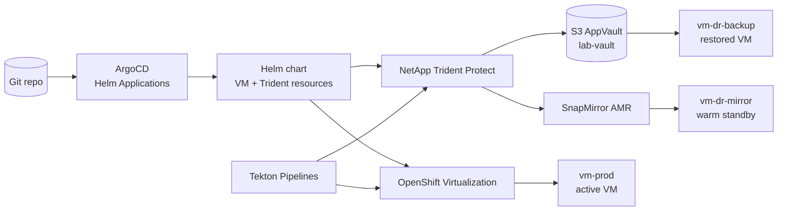

# Modern Virtualization, GitOps, Tekton, and NetApp Trident Protect

This demo shows how a VM platform can look and operate when it is treated as cloud-native infrastructure instead of a separate virtualization silo.

The story is not just disaster recovery. The complete narrative is:

- A VM is declared in Git and reconciled by ArgoCD from a Helm chart.
- Application installation, upgrade, smoke testing, and rollback are orchestrated by Tekton pipelines.
- OpenShift Virtualization provides the VM runtime and VM console experience.
- NetApp Trident provides fast storage cloning, snapshots, backup, restore, and SnapMirror-based DR.
- Operators use the OpenShift console, ArgoCD UI, and Pipelines UI to see the same state that the CLI and Git declare.

The audience should leave with one message: modern virtualization is VM lifecycle, app lifecycle, storage protection, and DR expressed as code and driven by controllers.

## Demo Positioning

Use this demo when the audience cares about any of these questions:

- How do we modernize VM operations without rewriting the application?
- How do we make VM changes auditable and repeatable?
- How do we upgrade and roll back VM-hosted applications without manual SSH sessions?
- How do we protect a VM with NetApp snapshots, backups, and replication?
- How do GitOps, Tekton, OpenShift Virtualization, and Trident fit together in a single operating model?

## Core Narrative

The demo should run in six acts.

### Act 1: GitOps Creates The VM Platform

Start with Git, not the console wizard.

Show:

- `argocd/argocd-prod-app.yaml`: ArgoCD owns the app.
- `chart/values.yaml`: VM defaults, storage class, boot source snapshot, and Trident settings.
- `chart/templates/vm.yaml`: the VM is a Kubernetes object.
- `chart/templates/trident-app.yaml`: Trident Protect tracks the namespace as an application.

Run:

```bash
oc create clusterrolebinding openshift-gitops-controller-admin-global \
  --clusterrole=cluster-admin \
  --serviceaccount=openshift-gitops:openshift-gitops-argocd-application-controller \
  --dry-run=client -o yaml | oc apply -f -

oc apply -f gitops-trident-protect-dr-demo/argocd/argocd-prod-app.yaml
```

Console moment:

- Open the OpenShift console.
- Go to `Virtualization -> VirtualMachines`.
- Select project `vm-prod`.
- Show `centos-vm` running.
- Open the VM details page and point out CPU, memory, disk, network, and YAML tabs.

Speaker note:

> This is the first contrast with vCenter. We can still give operators a familiar VM console, but the source of truth is Git and Kubernetes controllers. A VM is no longer a ticket plus a wizard. It is a reviewed, versioned artifact.

### Act 2: Tekton Installs The Application

The VM is running, but the application should not be installed by a human SSH session.

The intended flow mirrors the existing `gitops-vmware-virt-demo` lifecycle:

- Tekton waits until the VM is ready.
- Ansible or shell tasks install the application inside the guest.
- A smoke test validates `/health` through the service.
- The pipeline result becomes the audit trail.

Recommended implementation:

- Reuse the existing concepts from `gitops-vmware-virt-demo/pipelines/install-pipeline.yaml`.
- Keep app configuration in `pipelines/app-version.yaml`.
- Keep guest access through Kubernetes Secrets and cloud-init, not passwords.
- Expose the application through a Kubernetes `Service`, preferably a LoadBalancer when the cluster supports it.

Console moment:

- Open `Pipelines -> Pipelines` in the OpenShift console.
- Show the `install-app` pipeline DAG.
- Open the PipelineRun logs while it installs v1.0.
- Switch to `Networking -> Services` and show the service selector and endpoint.

Speaker note:

> The guest is still a VM, but operations are no longer a manual VM procedure. Tekton gives us the same pipeline discipline we use for containers: logs, task status, retries, and auditability.

### Act 3: Upgrade The Application With Blue/Green VM Lifecycle

This is the main virtualization modernization moment.

The desired story is the same proven pattern as the existing VMware demo:

1. Blue VM is active and serving v1.0.
2. A single Git change bumps `pipelines/app-version.yaml` from `v1.0` to `v2.0`.
3. Tekton snapshots the active blue VM before changing anything.
4. Tekton resolves the generated rootdisk `VolumeSnapshot`.
5. ArgoCD Helm parameters start a green VM from the blue rootdisk snapshot.
6. Tekton upgrades the app on green to v2.0.
7. Tekton smoke-tests green directly.
8. If the smoke test passes, ArgoCD moves traffic to green and halts blue.
9. If the smoke test fails, traffic remains on blue and green is halted or deleted.

The upgrade should not commit transient runtime state back to Git. Git records the app version bump. Runtime state changes are ArgoCD Helm parameter overrides.

Recommended commands to narrate:

```bash
ruby -0pi -e 'gsub(/version: "v[0-9.]+"/, "version: \"v2.0\"")' \
  gitops-trident-protect-dr-demo/pipelines/app-version.yaml

git add gitops-trident-protect-dr-demo/pipelines/app-version.yaml
git commit -m 'bump app version to v2.0'
git pull --rebase --autostash origin main && git push origin main
```

Console moment:

- In ArgoCD, show the production app rendering the Helm chart.
- In the OpenShift console, show two VMs during the upgrade: blue running and green starting.
- In the Pipelines UI, show the upgrade pipeline DAG: snapshot, start green, upgrade, smoke test, cutover.
- In the OpenShift console, show the service selector moving from blue to green.

Speaker note:

> This is not just backup. This is day-2 VM operations as code. We are using storage snapshots to make green a point-in-time clone of blue, then using Tekton to make the app change safe before moving traffic.

### Act 4: Roll Back Without Rebuilding The World

Rollback should be shown immediately after upgrade, because it proves the operating model.

Rollback story:

1. Blue is restarted while traffic still flows to green.
2. ArgoCD parameters move traffic back to blue.
3. Green is halted or deleted.
4. Helm overrides are cleared so the Git baseline takes over again.
5. The service returns to v1.0 on blue.

Use the existing VMware demo rollback as the implementation reference:

- Patch blue `runStrategy=Always`.
- Wait for the blue VMI to be ready.
- Patch service traffic back to blue.
- Halt or delete green.
- Clear ArgoCD Helm parameters.

Console moment:

- In OpenShift Virtualization, show blue moving back to `Running` and green moving to `Halted`.
- In ArgoCD, show Helm parameter overrides before and after cleanup.
- In Pipelines, show rollback as a controlled operation rather than an emergency SSH session.

Speaker note:

> Rollback is where VM automation usually becomes manual. Here it stays declarative. The service selector and VM run strategies are state, and controllers converge them.

### Act 5: Pattern B, S3 Backup And Namespace Restore

After proving app lifecycle, introduce Trident Protect as the safety net and mobility layer.

This pattern is portable and easy to understand:

1. Tekton creates a Trident Protect `Backup` for `centos-vm-app`.
2. Trident Protect snapshots the VM storage and archives metadata and data through `lab-vault`.
3. Tekton creates a `BackupRestore` in `vm-dr-backup`.
4. Trident Protect maps `vm-prod` to `vm-dr-backup`.
5. The VM and PVC are recreated from S3-backed backup data.

Run:

```bash
oc apply -f gitops-trident-protect-dr-demo/pipelines/tasks/trident-protect-backup.yaml -n vm-prod
oc apply -f gitops-trident-protect-dr-demo/pipelines/tasks/trident-protect-restore.yaml -n vm-prod
oc apply -f gitops-trident-protect-dr-demo/pipelines/dr-pipeline.yaml -n vm-prod
```

Console moment:

- In the Pipelines UI, show the DR pipeline running.
- In `trident-protect`, show the Kopia backup or restore pod while data is moving.
- In `vm-dr-backup`, show the restored VM appearing.
- In OpenShift Virtualization, open the restored VM console and validate the app/data.

Speaker note:

> This is the portable DR path. It works when you want an on-demand recovery point, namespace-level mobility, or a restore into a different target environment using object storage.

### Act 6: Pattern A, SnapMirror-Based Warm Standby

End with the high-performance DR story.

Pattern A uses Trident Protect `AppMirrorRelationship` to create a warm standby using NetApp SnapMirror semantics.

Flow:

1. Source `Application` runs in `vm-prod`.
2. ArgoCD deploys the mirror chart into `vm-dr-mirror`.
3. The AMR is `Established` and the target PVC is read-only.
4. Failover changes `desiredState` to `Promoted`.
5. Trident Protect promotes storage to read-write and recreates the VM metadata.
6. The VM boots in the DR namespace.

Run:

```bash
oc apply -f gitops-trident-protect-dr-demo/argocd/argocd-dr-mirror-app.yaml

SOURCE_UID=$(oc get application.protect.trident.netapp.io centos-vm-app -n vm-prod \
  -o jsonpath='{.metadata.uid}')

oc patch application.argoproj.io trident-dr-mirror -n openshift-gitops --type=merge \
  -p '{"spec":{"source":{"helm":{"parameters":[{"name":"trident.amr.sourceAppUID","value":"'"${SOURCE_UID}"'"}]}}}}'

oc patch application.argoproj.io trident-dr-mirror -n openshift-gitops --type=json \
  -p '[{"op":"add","path":"/spec/source/helm/parameters/1","value":{"name":"trident.amr.desiredState","value":"Promoted"}}]'
```

Console moment:

- In ArgoCD, show `trident-dr-mirror` syncing Helm parameters.
- In OpenShift console, show the `AppMirrorRelationship` custom resource state change from `Established` to `Promoted`.
- In Virtualization, switch to `vm-dr-mirror` and show the promoted VM running.

Speaker note:

> This is the warm-standby path. S3 backup/restore is portable. SnapMirror is fast. Both are controlled by Kubernetes APIs and can be driven by GitOps.

## Recommended Console Flow

Use the console intentionally. Do not stay in the terminal the whole time.

| Moment | Console | What To Show | Why It Matters |
|---|---|---|---|
| VM creation | OpenShift Virtualization | `centos-vm` in `vm-prod` | Operators still get a VM console and VM inventory |
| GitOps sync | ArgoCD | `trident-dr-prod` app and rendered Helm resources | Git is the source of truth |
| App install | OpenShift Pipelines | `install-app` DAG and logs | Guest changes are auditable automation |
| Upgrade | Pipelines + Virtualization | snapshot/start green/upgrade/smoke/cutover | VM lifecycle is pipeline-driven |
| Rollback | ArgoCD + Virtualization | parameter overrides and VM run strategies | Recovery is declarative state, not panic ops |
| Backup | Pipelines + Trident CRs | `Backup`, `BackupRestore`, Kopia pod | Trident Protect automates data protection |
| Mirror DR | ArgoCD + Trident CRs | `AppMirrorRelationship` states | DR is GitOps-compatible |

## What Should Be Improved Next

The current automated `test-flow.sh` validates the production VM, Pattern B backup/restore pipeline, and Pattern A AMR promotion flow. To make the live demo narrative match the stronger modernization story, the next implementation pass should add the application lifecycle from the existing VMware demo into this module.

Prioritized improvements:

1. Add `pipelines/app-version.yaml` with `v1.0` baseline and `v2.0` upgrade target.
2. Port or adapt `install-pipeline.yaml`, `upgrade-pipeline.yaml`, `smoke-test.yaml`, and Ansible task concepts from `gitops-vmware-virt-demo`.
3. Extend the Helm chart from a single VM to blue/green VMs plus a service selector.
4. Keep Trident storage classes and boot sources as the backing storage story.
5. Add rollback as a first-class Tekton pipeline or scripted act.
6. Add console screenshots or presenter notes for OpenShift Virtualization, ArgoCD, Pipelines, and Trident Protect CRs.
7. Keep `test-flow.sh` as the gate: no narrative step should be added to the live script unless the headless flow validates it.

## Architecture



## Repository Layout

```text
gitops-trident-protect-dr-demo/
├── README.md
├── chart/
│   ├── Chart.yaml
│   ├── values.yaml
│   ├── values-prod.yaml
│   ├── values-dr-mirror.yaml
│   ├── values-dr-backup.yaml
│   └── templates/
│       ├── vm.yaml
│       ├── service.yaml
│       ├── trident-app.yaml
│       └── trident-amr.yaml
├── argocd/
│   ├── argocd-prod-app.yaml
│   └── argocd-dr-mirror-app.yaml
├── pipelines/
│   ├── dr-pipeline.yaml
│   └── tasks/
│       ├── trident-protect-backup.yaml
│       └── trident-protect-restore.yaml
├── scripts/
│   └── cleanup.sh
└── demo/
    ├── demo-trident.sh
    └── test-flow.sh
```

## Prerequisites

| Requirement | Notes |
|---|---|
| OpenShift Virtualization | KubeVirt VM runtime and console |
| OpenShift GitOps | ArgoCD instance in `openshift-gitops` |
| OpenShift Pipelines | Tekton tasks and PipelineRuns |
| NetApp Trident | `storage-class-iscsi` and CSI snapshots |
| Trident Protect | CRDs and controller in `trident-protect` |
| AppVault | `lab-vault` available and healthy |
| CentOS boot source | `centos-stream10` DataSource ready |

Quick checks:

```bash
oc get ns openshift-gitops openshift-pipelines openshift-cnv trident-protect
oc get appvault -A
oc get storageclass storage-class-iscsi
oc get datasource centos-stream10 -n openshift-virtualization-os-images \
  -o jsonpath='{.status.conditions[?(@.type=="Ready")].status}{"\n"}'
oc get crd | grep protect.trident.netapp.io
```

## Running The Current Automated Flow

The current headless flow validates the DR parts of the module:

```bash
./gitops-trident-protect-dr-demo/demo/test-flow.sh
```

The script:

1. Cleans up stale state.
2. Grants demo RBAC for ArgoCD and Tekton.
3. Deploys the production VM and Trident Protect Application through ArgoCD.
4. Runs the S3 backup/restore Tekton pipeline.
5. Establishes and promotes the AMR mirror path.
6. Verifies restored/promoted VMs reach `Running`.

## Cleanup

```bash
./gitops-trident-protect-dr-demo/scripts/cleanup.sh
```

The cleanup script removes demo namespaces, ArgoCD applications, demo cluster rolebindings, Trident Protect resources, and stuck CSI snapshot finalizers.
