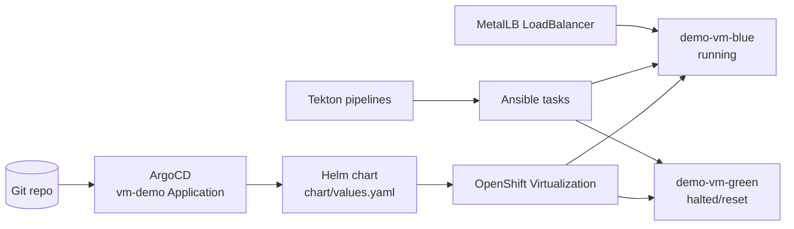
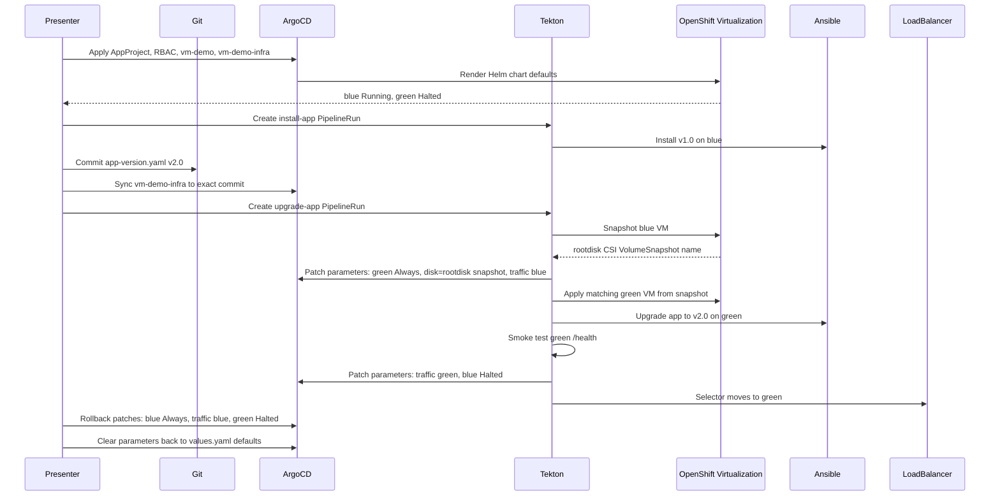
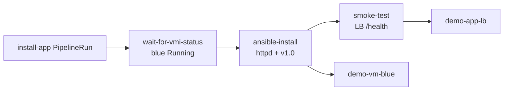
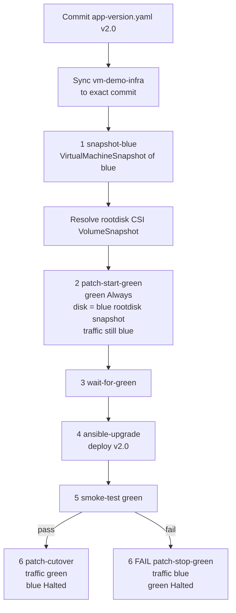
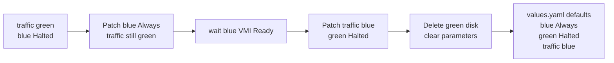

# Git-Driven VM Lifecycle Demo — VMware Admin Edition

A live demo for VMware administrators showing how OpenShift Virtualization uses GitOps, Helm, ArgoCD, Tekton, and Ansible to automate the VM application lifecycle: create a VM, deploy an app, perform a blue/green upgrade from a blue VM snapshot, cut traffic over, and roll back.

The demo is intentionally opinionated:

- **Git holds the reset state**: blue running, green halted, traffic on blue.
- **One Git commit triggers the upgrade**: `pipelines/app-version.yaml` changes from `v1.0` to `v2.0`.
- **VM state changes do not require Git commits**: the upgrade pipeline patches ArgoCD Helm parameters on the `vm-demo` Application.
- **Green is created from blue**: the pipeline snapshots `demo-vm-blue`, resolves the generated rootdisk CSI `VolumeSnapshot`, and starts `demo-vm-green` from that snapshot.
- **Rollback is parameter-driven**: start blue, move traffic to blue, halt/reset green, then clear runtime overrides.

> **Speaker note — opening**
> This is not "VMs on Kubernetes" as a one-off import. This is the VM lifecycle expressed as code and reconciled by controllers: Git for the baseline, ArgoCD for desired state, Tekton for workflow, Ansible for guest configuration, and OpenShift Virtualization for the VM runtime.

---

## Intro diagram



At rest, `chart/values.yaml` describes the reset state:

```yaml
blue:
  runStrategy: Always

green:
  runStrategy: Halted
  diskSnapshot:
    name: centos-stream10-8a1243274fb1
    namespace: openshift-virtualization-os-images

traffic:
  activeSlot: blue
```

> **Speaker note — VMware comparison**
> The standby VM is defined and ready, but it is halted. It consumes no CPU or RAM until the pipeline starts it. In vCenter this is usually a powered-off VM plus manual process. Here it is desired state that can be reconciled and reset.

---

## End-to-end flow overview



> **Speaker note — the key message**
> The only Git change during the upgrade is the application version bump. The pipeline handles VM runtime state by patching ArgoCD parameters. This avoids noisy Git commits for transient lifecycle state while keeping desired state visible on the ArgoCD Application.

---

## What `demo/demo.sh` does

`demo/demo.sh` is the presentation version of the same flow validated by `demo/test-flow.sh`. It uses `demo-magic` for typing effects and pauses, but the cluster actions match the non-interactive test flow.

### Hidden pre-flight reset

Before the first slide, the script:

1. Clears `vm-demo.spec.source.helm.parameters`.
2. Resets `pipelines/app-version.yaml` to `v1.0`.
3. Commits and pushes only if the version file changed.

> **Speaker note**
> Do not narrate the pre-flight reset unless asked. It exists so the demo can be run repeatedly without hand cleanup.

### Setup 1 — namespace and secrets

The script creates:

- `vm-demo` namespace.
- `vm-ssh-key`, mounted into Tekton tasks so Ansible can SSH into the VMs.
- `vm-cloud-init`, containing userdata that injects the SSH public key into the VM.

> **Speaker note**
> There are no passwords in the VM workflow. Tekton mounts a Kubernetes Secret, Ansible uses SSH, and cloud-init places the matching public key in the guest.

### Setup 2 — MetalLB

The script verifies the existing MetalLB `IPAddressPool` referenced by `chart/templates/service-lb.yaml`.

The demo does **not** create or delete MetalLB configuration.

> **Speaker note**
> This is the "real IP address" moment. The VM app is exposed through a Kubernetes LoadBalancer, not a manually managed external appliance.

### Setup 3 — ArgoCD

The script:

1. Enables ArgoCD source namespaces for `vm-demo`.
2. Applies the `vm-demo` AppProject and RBAC.
3. Applies the `vm-demo` Application for the Helm chart.
4. Applies the `vm-demo-infra` Application for Tekton tasks, pipelines, event listener, and route.
5. Waits for `vm-demo` to reach the current Git revision.
6. Explicitly syncs `vm-demo-infra` to the exact current commit SHA.

> **Speaker note**
> The exact-SHA sync matters. It avoids cached `main` ambiguity and makes the demo deterministic after the version bump commit.

### Act 1 — Git drives VM creation

The script shows:

- `chart/values.yaml`.
- `chart/templates/vm-blue.yaml`.
- `chart/templates/vm-green.yaml`.
- ArgoCD status.
- Tekton pipeline infrastructure.
- LoadBalancer selector pointing at blue.

Initial runtime state:

| Resource | Expected state |
|---|---|
| `demo-vm-blue` | `Running` |
| `demo-vm-green` | `Stopped` / `Halted` |
| `demo-app-lb` selector | `demo-vm-blue` |

> **Speaker note**
> Both VMs are described in Git. Blue is running; green is a zero-compute standby. The service selector is also code, so traffic placement is part of desired state.

### Act 2 — Tekton + Ansible deploy v1.0

The script:

1. Creates `pipelines/install-pipelinerun.yaml`.
2. Streams the `install-app` logs.
3. Waits for the PipelineRun to succeed.
4. Curls the MetalLB IP and shows v1.0 served by blue.



> **Speaker note**
> This is the "guest configuration as pipeline" moment. We did not SSH manually. The same toolchain can configure VMs and containers.

### Act 3 — blue/green upgrade from a blue snapshot

The script:

1. Updates `pipelines/app-version.yaml` from `v1.0` to `v2.0`.
2. Commits, pulls with `--autostash`, and pushes to `main`.
3. Syncs `vm-demo-infra` to the exact new commit.
4. Creates `pipelines/upgrade-pipelinerun.yaml`.
5. Streams `upgrade-app` logs.
6. Waits for success.
7. Shows the snapshot chain proving green was cloned from blue.
8. Shows ArgoCD Helm parameters and service selector.
9. Curls the same LoadBalancer IP and shows v2.0 served by green.



The critical snapshot lookup is:

```text
VirtualMachineSnapshot
  -> status.virtualMachineSnapshotContentName
  -> VirtualMachineSnapshotContent.status.volumeSnapshotStatus[0].volumeSnapshotName
  -> green.dataVolumeTemplates[0].spec.source.snapshot.name
```

> **Speaker note — snapshot approach**
> Green is not a fresh golden-image install. The pipeline snapshots blue before the upgrade, resolves the generated rootdisk VolumeSnapshot, and uses that as green's disk source. That gives us a clone of the pre-upgrade blue VM, then Ansible applies v2.0 to green.

> **Speaker note — zero downtime**
> Traffic stays on blue while green boots and is upgraded. Only after the smoke test passes does the LoadBalancer selector move to green and blue halt.

### Bonus — rollback

Rollback is also aligned with `test-flow.sh`:

1. Capture the current green snapshot parameters.
2. Patch ArgoCD parameters so blue is `Always` while traffic still points at green.
3. Directly patch blue `runStrategy=Always` and wait for the blue VMI to be Ready.
4. Patch ArgoCD parameters so traffic is blue and green is `Halted`.
5. Directly patch the LoadBalancer selector to blue and green `runStrategy=Halted`.
6. Delete green VM/DataVolume/PVC.
7. Clear Helm parameters.
8. Wait until ArgoCD has reset green to the values.yaml defaults: halted and using the golden-image snapshot.
9. Curl the LoadBalancer IP and show v1.0 served by blue.



> **Speaker note — rollback**
> In vCenter, rollback means finding the snapshot, reverting or cloning, waiting, and manually moving traffic. Here, rollback is desired-state patches plus a final reset to the Git baseline. No VM-state Git commits are needed.

---

## Repository layout

```text
gitops-vmware-virt-demo/
├── argocd/
│   ├── application.yaml         # vm-demo: Helm chart for VMs/services
│   ├── application-infra.yaml   # vm-demo-infra: Tekton infrastructure
│   ├── appproject.yaml
│   └── rbac.yaml
├── chart/
│   ├── Chart.yaml
│   ├── values.yaml              # reset state
│   └── templates/
│       ├── service-*.yaml
│       ├── vm-blue.yaml
│       └── vm-green.yaml
├── demo/
│   ├── demo.sh                  # presentation flow
│   └── test-flow.sh             # non-interactive validation flow
├── pipelines/
│   ├── app-version.yaml         # only Git change that triggers upgrade
│   ├── install-pipeline.yaml
│   ├── install-pipelinerun.yaml
│   ├── upgrade-pipeline.yaml
│   └── upgrade-pipelinerun.yaml
└── scripts/
    ├── cleanup.sh
    └── setup-secrets.sh
```

---

## Prerequisites

| Requirement | Notes |
|---|---|
| OpenShift Virtualization | KubeVirt, CDI, SSP, CNAO |
| OpenShift GitOps | ArgoCD instance in `openshift-gitops` |
| OpenShift Pipelines | Tekton with hub and cluster resolvers |
| MetalLB | Existing `IPAddressPool`; the demo reuses it |
| CSI snapshots | `VolumeSnapshotClass` available for the VM storage class |
| CentOS Stream 10 boot source | Ready in `openshift-virtualization-os-images` |
| SSH key | Defaults to `~/.ssh/rh-demos` and `~/.ssh/rh-demos.pub` |

Quick checks:

```bash
oc get csv -n openshift-cnv | grep -E "Succeeded|Failed"
oc get csv -n openshift-gitops | grep -E "Succeeded|Failed"
oc get csv -n openshift-pipelines | grep -E "Succeeded|Failed"
oc get ipaddresspool metallb -n metallb-system
oc get volumesnapshotclass
oc get datasource centos-stream10 -n openshift-virtualization-os-images \
  -o jsonpath='{.status.conditions[?(@.type=="Ready")].status}'
```

---

## Running the demo

From the repository root:

```bash
./gitops-vmware-virt-demo/demo/demo.sh
```

Or from the demo directory:

```bash
cd gitops-vmware-virt-demo
./demo/demo.sh
```

### Running on ROSA with NetApp storage

The ROSA path keeps the original demo unchanged and uses ROSA-specific entrypoints:

```bash
./gitops-vmware-virt-demo/demo/demo-rosa.sh
```

ROSA-specific assumptions:

| Requirement | ROSA value |
|---|---|
| VM storage | NetApp Trident `storage-class-iscsi` |
| VM disk mode | `ReadWriteMany` + `Block` |
| Boot source | Ready `centos-stream10` DataSource in `openshift-virtualization-os-images` |
| Load balancer | AWS native Service `type: LoadBalancer` hostname/IP |
| ArgoCD Application | `argocd/application-rosa.yaml` with `chart/values-rosa.yaml` |

Before running, verify that `chart/values-rosa.yaml` matches the current boot-source snapshot:

```bash
oc get datasource centos-stream10 -n openshift-virtualization-os-images \
  -o jsonpath='{.status.source.snapshot.namespace}/{.status.source.snapshot.name}{" ready="}{.status.conditions[?(@.type=="Ready")].status}{"\n"}'
```

If the snapshot name has changed, update `chart/values-rosa.yaml` before running the ROSA scripts.

Useful flags:

| Flag | Behavior |
|---|---|
| `-n` | No wait; auto-advance |
| `-d` | Disable simulated typing |
| `-w <secs>` | Auto-advance after N seconds |
| `--debug` | Trace extra debug output |

Keep these views open:

- ArgoCD `vm-demo` and `vm-demo-infra` Applications.
- OpenShift Virtualization VM list.
- OpenShift Pipelines PipelineRuns.
- GitHub commit history.
- A browser or terminal showing `curl http://<LoadBalancer IP>/`.

---

## Validating the flow without demo-magic

Run the non-interactive test flow:

```bash
./gitops-vmware-virt-demo/scripts/cleanup.sh
./gitops-vmware-virt-demo/demo/test-flow.sh
```

For ROSA:

```bash
./gitops-vmware-virt-demo/scripts/cleanup.sh
./gitops-vmware-virt-demo/demo/test-flow-rosa.sh
```

The test flow verifies:

1. v1.0 is installed and served from blue.
2. The upgrade PipelineRun succeeds.
3. Green uses the generated rootdisk CSI `VolumeSnapshot` from the blue `VirtualMachineSnapshot`.
4. Traffic moves to green and v2.0 is served.
5. Rollback returns traffic to blue.
6. Green resets halted from the golden-image snapshot.

---

## Cleanup

```bash
./gitops-vmware-virt-demo/scripts/cleanup.sh
```

Cleanup removes demo-created namespace resources, ArgoCD Applications/AppProject/RBAC, VM snapshots, and Helm parameter overrides. It leaves shared MetalLB configuration untouched.

---

## Closing talking points

1. **VMs as desired state**: both blue and green are in the Helm chart.
2. **Zero-compute standby**: green is declared but halted until needed.
3. **Snapshot-based green**: green is created from blue's rootdisk VolumeSnapshot, not from a fresh image.
4. **One Git commit triggers the upgrade**: the version bump is the only upgrade commit.
5. **Runtime state through ArgoCD parameters**: start green, cutover, and rollback are visible as Application overrides.
6. **Same platform primitives**: GitOps, Tekton, Ansible, Services, snapshots, and RBAC work for VMs and containers.
